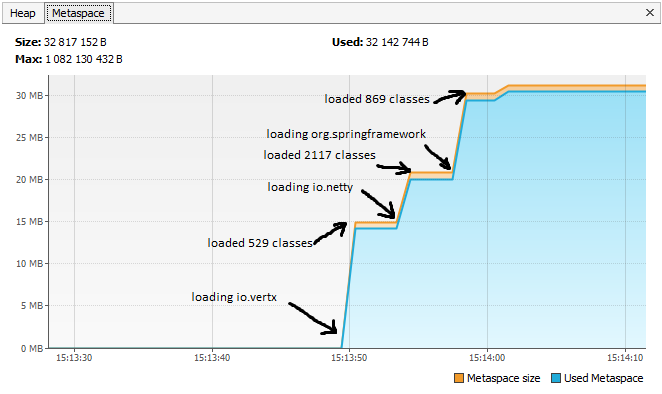

Please open 'ru.netology.JvmExperience' in VisualVm

## 15:13:49.308866500: loading io.vertx

## 15:13:50.172952400: loaded 529 classes

## 15:13:53.192525500: loading io.netty

## 15:13:54.565211100: loaded 2117 classes

## 15:13:57.580947200: loading org.springframework

## 15:13:57.984894: loaded 869 classes

## 15:14:00.991747: now see heap

## 15:14:00.992783: creating 5000000 objects

## 15:14:01.697073400: created

## 15:14:04.699964800: creating 5000000 objects

## 15:14:05.410202800: created

## 15:14:08.492739900: creating 5000000 objects

## 15:14:08.882018100: created

