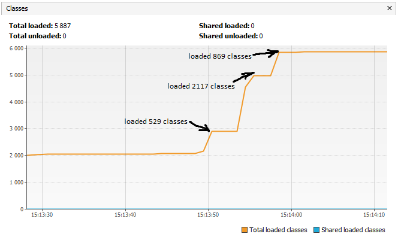

# Исследование работы программы с помощью VisualVm

В данной задаче я исследовал работу программы с помощью VisualVm. Исследуемая программа находится [здесь](https://github.com/Arsennikum/jvm-visualvm-experience)  

После запуска программы JvmExperience в консоли появилось сообщение:  
```Please open 'ru.netology.JvmExperience' in VisualVm```

Далее я перешел в окно программы VisualVm, где в реальном времени мог наблюдать как загружаются классы, как используются *Metaspace* и *Heap*.

В процессе выполнения программа также выводит в консоль основную информацию о действиях, которые она совершает. На следующих скриншотах я отметил строки из консоли, связанные с *Metaspace*.




Строка: ```15:13:49.308866500: loading io.vertx```
* Началась загрузка классов из пакета "io.vertx"
* Размер *Metaspace* плавно увеличивается
* На графике классов также видно, как в этот момент времени растет количество загруженных классов

Строка: ```15:13:50.172952400: loaded 529 classes```
* Завершилась загрузка классов из пакета "io.vertx"
* Размер *Metaspace* перестал увеличиваться
* На графике классов также видно, что рост количества загруженных классов остановился
* В течение выдержки времени, установленной в методе main класса JvmExperience, график горизонтальный, размер *Metaspace* не меняется

Строка: ```15:13:53.192525500: loading io.netty```
* Началась загрузка классов из пакета "io.netty"
* Размер *Metaspace* плавно увеличивается
* На графике классов также видно, как в этот момент времени растет количество загруженных классов

Строка: ```15:13:54.565211100: loaded 2117 classes```
* Завершилась загрузка классов из пакета "io.netty"
* Размер *Metaspace* перестал увеличиваться
* На графике классов также видно, что рост количества загруженных классов остановился 
* В течение выдержки времени, установленной в методе main класса JvmExperience, график горизонтальный, размер *Metaspace* не меняется

Строка: ```15:13:57.580947200: loading org.springframework```
* Началась загрузка классов из пакета "org.springframework"
* Размер *Metaspace* плавно увеличивается
* На графике классов также видно, как в этот момент времени растет количество загруженных классов

Строка: ```15:13:57.984894: loaded 869 classes```
* Завершилась загрузка классов из пакета "org.springframework"
* Размер *Metaspace* перестал увеличиваться
* На графике классов также видно, что рост количества загруженных классов остановился
* В течение выдержки времени, установленной в методе main класса JvmExperience, график горизонтальный, размер *Metaspace* не меняется

Строка: ```15:14:00.991747: now see heap```   
Теперь смотрим *Heap*


Строка: ```15:14:00.992783: creating 5000000 objects```
* Началось создание объектов
* Размер *Heap* плавно увеличивается

Строка: ```15:14:01.697073400: created```
* Завершилось cоздание объектов
* Размер *Heap* перестал увеличиваться
* В течение выдержки времени, установленной в методе main класса JvmExperience, график горизонтальный, размер *Heap* не меняется

Строка: ```15:14:04.699964800: creating 5000000 objects```
* Началось создание объектов
* Размер *Heap* плавно увеличивается

Строка: ```15:14:05.410202800: created```
* Завершилось cоздание объектов
* Размер *Heap* перестал увеличиваться
* В течение выдержки времени, установленной в методе main класса JvmExperience, график горизонтальный, размер *Heap* не меняется

Строка: ```15:14:08.492739900: creating 5000000 objects```
* Началось создание объектов
* Размер *Heap* плавно увеличивается

Строка: ```15:14:08.882018100: created```
* Завершилось cоздание объектов
* Размер *Heap* перестал увеличиваться
* В течение выдержки времени, установленной в методе main класса JvmExperience, график горизонтальный, размер *Heap* не меняется

Следует отметить, что графики *Metaspace* и *Heap* не всегда повторяют графики *Metaspace used* и *Heap used*. Обычно схема такая: выделяется размер *Metaspace/Heap*, далее по мере использования, если JVM понимает, что выделенного размера не достаточно, то увеличивает *Metaspace/Heap*. Это будет происходить до тех пор, пока размеры *Metaspace и *Heap* не достигнут установленных максимальных значений.

На последнем скриншоте я отметил два момента, когда в процессе выполнения программы "приходил" сборщик мусора.  
Видно, как значение используемого *Heap* уменьшается, и график на этих участках убывающий.


